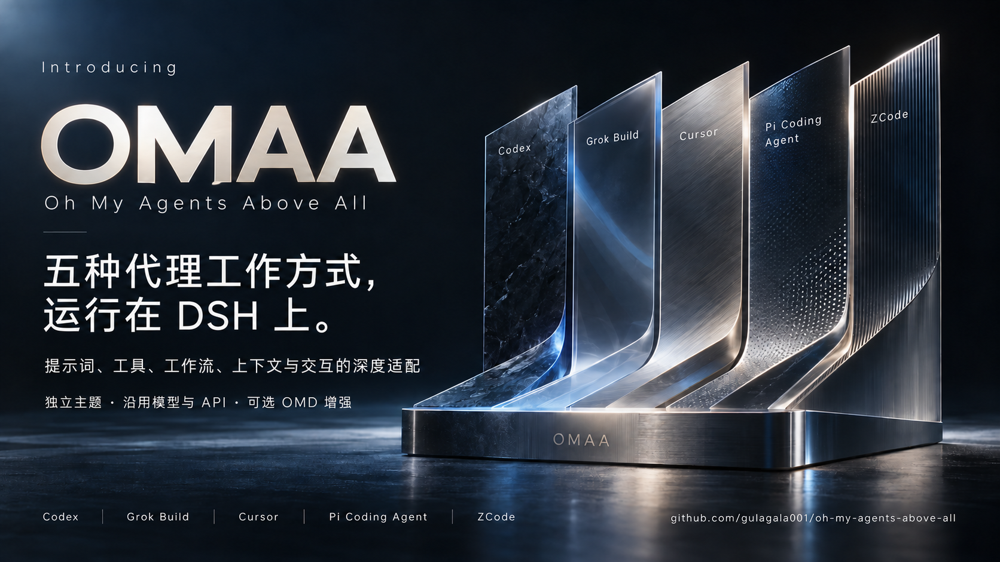

# Oh My Agents Above All



OMAA 是 DSH 插件，提供 **Codex、Grok Build、Cursor、Pi Coding Agent、ZCode** 五个独立深度预设。使用 DSH 已配置的模型/API、原生工具循环、权限与会话，装配完整来源提示词及产品适配，并提供各自的明暗主题。不需要安装或登录五个官方客户端。

当前源码为 **OMAA `0.2.1-alpha.2.omaa.0.15.0` 未发布候选**，Node.js 要求 `>=22.19`，开发 SDK 为官方 DSH `0.2.1-alpha.2`。本次前端验收绑定实际 a2 SDK 与冻结工件；rc.2／alpha.1 的 0.15 独立 SDK 构建与验收正在准备，历史 0.14.2 结果不能替代本次验证。[版本适配](docs/compatibility.md) · [验证记录](docs/verification.md) · [会话工作台](docs/frontend-workbench.md)。

本轮前端候选配对 **OMD `0.13.0`**，尚未创建 tag 或 Release。候选验收使用与实际宿主匹配的本地 `.tgz`、锁定 SDK 和 SHA-256。公开安装仍使用已发布 OMAA `0.13.1` 与 OMD `0.10.0`，不包含本轮新能力；具体文件名见[安装指南](docs/install.md)。

与 OMD 同 profile 使用时选择同一批次、同一宿主的配对 OMD，保留增强与外观协调接口。独立使用 OMAA 无需 OMD。Web／CLI 与 Desktop 均按正在运行的完整 DSH 版本选择附件；实际验收的平台与范围见[验证记录](docs/verification.md)。

## 安装与使用

从 GitHub Releases 下载对应宿主的 OMAA 包与 SHA256；需要 OMD 增强或已有 OMD 的同 profile 安装，同时下载兼容 OMD 包。核对附件哈希后，通过正在使用的 DSH profile 原生插件入口安装，先安装兼容 OMD，再安装 OMAA。以下以 `web` 为例，路径替换为实际包位置：

```sh
dsh plugin --profile web add file:/absolute/path/trisoul_x-0.2.1-alpha.1.omd.0.10.0.tgz
dsh plugin --profile web add file:/absolute/path/oh-my-agents-above-all-0.2.1-alpha.1.omaa.0.13.1.tgz
dsh web
```
当前候选的本地安装示例（尚未公开发行）：

```sh
dsh plugin --profile web add file:/absolute/path/trisoul_x-0.2.1-alpha.2.omd.0.13.0.tgz file:/absolute/path/oh-my-agents-above-all-0.2.1-alpha.2.omaa.0.15.0.tgz
```

独立使用 OMAA 时可只添加 OMAA 文件。rc.2／alpha.1 须等待本次独立 SDK 构建与实际验收的对应工件，不混用 a2 包。


已有其它 CLI profile 时，安装与启动使用同一个 profile。DSH Desktop 的 profile 由应用管理，可使用桌面原生插件管理器，或与桌面实际 SDK 对应的官方 CLI 和准确 profile 安装；不要以另一宿主的 Web CLI 代替。安装完成后重载对应 profile；原来的模型/provider 配置继续生效。

在新会话中选择 `Codex · OMAA`、`Grok Build · OMAA`、`Cursor · OMAA`、`Pi Coding Agent · OMAA` 或 `ZCode · OMAA`。输入区预设按钮可打开右侧设置，通用设置中只保留一个「Oh My Agents Above All」入口，版本更新与 Pi 本地扩展在该页折叠区。

- 工作模式：除 Pi 的精简默认模式外，支持执行、只读 Ask 和原生 Plan 审阅/批准流程。
- 身份：与 OMD 共存时沿用其人格／身份设置，修改开头身份文字；默认、内置、自定义及关闭均生效，不依赖工具增强开关。产品行为与主题继续由所选预设负责。
- 主题：跟随产品、指定另一套主题、恢复 DSH 外观或使用兼容 OMD 外观；明暗设置与宿主同步。
- Cursor：加载适用的 MDC/项目规则，提供已记录文件变更的检查点查看与恢复。恢复会核对冲突并保留消息；它不是任意 shell 操作的全工作区快照。
- Cursor 审阅：可针对本回合或单个文件“查找问题”，进入实际只读问答模式，由当前模型检查变更；切回执行模式后继续修复。
- Codex：查看 Unstaged、Staged、Commit、Branch 和 Last turn；按文件或块暂存、取消暂存、撤回，选定代码行后立即发送反馈，或收集多文件批注一次提交。操作遵守宿主权限并拒绝过期比较。
- Grok Build：实时 stdout 监控与原生 interval 定时任务，使用同一作业/会话生命周期。
- Pi：加载 SYSTEM/APPEND、用户与项目规则、提示模板，以及项目/祖先 `.agents` 和深层技能资源；默认逐条 steer。Pi 分支面板可打开原生 parent 树、从已完成回合创建新会话，按需勾选离开分支摘要（默认关闭，使用当前模型）。分支共享目录，切换不回滚文件。
- Pi 本地扩展：源码已实现用户明确指定绝对 TS/JS 文件的执行白名单，默认空、不自动运行项目发现文件。只在 DSH 原生 subprocess/sandbox 中运行扩展 factory 与回调，接入工具、命令、异步输入/工具事件、原生问答、通知及附件；0.10.0 补齐输入后模板展开与 `before_agent_start`，支持可变系统选项、串行回调、自定义消息及运行内 force；0.11.0 补齐自定义消息的类型、Markdown、明暗颜色和隐藏显示；0.12.0 增加串行 `agent_start` / `turn_start` / `agent_end` 通知、完整结束消息及严格分帧，并修复取消通知和人工新输入的 force 边界。模型、工具循环与账号仍由 DSH 负责。OMAA 0.5 提供该扩展入口及活动回调内的动态工具、命令、事件注册；隔离原生执行检查已通过，使用方法与未支持 API 见 [Pi 文档](docs/products/pi.md)。
- ZCode：项目／全局保存工作流、按名列举及复用、参数声明与默认值。用户明确点名工作流，或启用 Pro/Ultra 后，使用实际工作流与结构化子代理结果，仍先加载 `zcode-workflows` 技能；按用户引用的 session id 回查原生历史，可使用当前已配置模型提取上下文。
- OMD 增强：默认关闭；基础增强提供 CodeGraph 和 Computer Use，可另选 Pro 或 Ultra 工作方式。高级方式复用 OMD 控制与持久化，使用当前模型最高可用 reasoning effort，保留 provider/model；开启高级方式自动开启增强，关闭增强同时关闭高级方式。Ask/Plan 暂停高级编排，恢复执行后可继续。主题选择独立。

运行中的会话先使用原生停止入口，再修改预设设置。文件、diff、工具结果、附件和继续工作仍使用 DSH 的现有界面与生命周期。

OMAA 0.6 提供 **ZCode TypeScript Actor 工作流**：固定原厂编译器、静态分析、schema 合成与 lowering 在执行前检查脚本，再交给 DSH 隔离 PTC 运行。`agent(name, persona)` 创建 Actor；同一 Actor 的多次 `ask<T>` 按 FIFO 复用持久原生 child，typed 结果通过 `submit_result` 校验，并在原生工具结果成功后提交。停止与收尾使用原生 jobs、取消及 child drain。保存时选择 `facade="zcode"`，复用时按保存的标记恢复该入口；已有 `facade="native"` JavaScript 工作流继续保留。

该适配输出真实静态 graph/causality 数据。OMAA 0.7.0 接入 `files.glob/read/grep`、`git.changedFiles/diff/status/log` 与字面命令 `world.run`：参数、限制、Git argv/解析、匹配及文本编码算法来自固定 ZCode 原文；执行复用 DSH 原生文件、subprocess、sandbox、当前权限与会话。grep 使用对应宿主官方 bundled ripgrep，支持桌面 asar 路径，不依赖系统 `rg`。超限明确拒绝，不返回截断成功；`world.run` 非零退出码作为正常结果返回，错误的 `code` 可在脚本中 catch。

一个隔离原版 DSH 的实际安装 fixture 已核对文件与 glob、UTF-16 BOM/CRLF、bundled grep、Git、相对命令路径、非零退出及上限拒绝、原生 workspace-write 和后台 Ask 取消；准确范围见 [ZCode 文档](docs/products/zcode.md)。它使用原生 workflow 工具权限边界，不提供 Bash 逐条命令审批、权限升级或原厂 workflow journal/replay。它不运行原厂 Actor 引擎或客户端。

OMAA 0.8.0 接入文件、Markdown 及 Chart/Table/Metrics/Board 工作流产物：内容与成功版本保存为 DSH 原生不可变附件，原厂校验、报告折叠和图表实现与宿主存储、权限及界面适配分开保留。独立右栏可从工具结果“查看产物”进入，按 run 浏览并调用原生停止；文件使用不可变快照的原生预览。一个最终原生 fixture 已核对快照、版本、冷重启、四种声明与分页/upsert、可 catch 失败、非法 spec 的父 run 失败及跨会话拒读。已配置 Space Bunny Free 的一个真实产物任务完成，原生 alpha Web UI 实点“查看产物”、两点 Chart、Table keyed upsert 和不可变 Markdown 原生预览已核对。UI 全面验收及 Desktop/Windows 产物 UI 仍未完成；0.8 的产物验证不覆盖下述 0.9.0 运行图／Amend；原厂 engine journal/replay 仍未实现。

OMAA 0.9.0 新增原版 ZCode Timeline／PhaseList 与 `amend_workflow`：修订前预检，停止并等待前驱，再以完成结果缓存和精确 native Actor 前缀创建 successor；支持同 run 并发上限调整，右栏可在同会话中打开前次／后续运行。一个原生 fixture 已核对缓存／前缀／重启／失败后继续、world 顺序且不重复效果及并发升降；Space Bunny Free 实际修订返回两个预期 marker 和正确 lineage。修订仅限当前会话；半转录续跑、精确工具 effect 分类、原模型 pin 继承与原厂 journal/replay 仍有差异，新任务使用当前 DSH 模型/API。无 phase 的 ask/world 传输错误已修复。具体见 [ZCode 契约](docs/products/zcode.md)。

Pi 普通会话保持精简工具，不显示或允许调用 delegation/jobs；开启 OMD 增强后可使用工作流支持。基础增强不强制工作流编排。安装或卸载 OMD 后需重载对应 profile，让预设重新选择工作流 engine；不支持无重载热切换。

## 五个预设的差异

| 预设 | 当前移植重点 | 明确差异 |
| --- | --- | --- |
| Codex | 官方完整指令/压缩、连续推进、真实 Git 范围与块操作、行反馈、桌面布局 | DSH 选择实际模型；未启用官方 persistent/cloud/app 专有运行层 |
| Grok Build | 官方条件主提示词、计划/提问/任务、实时监控、interval 调度、独立主题 | 原生作业/会话；无跨会话 durable、即时首 fire 或原厂七天 TTL |
| Cursor | 完整公开样本适配、MDC 规则、Plan/Ask、文件检查点、IDE/Agent 对话布局 | 样本非官方公开源码；专有 Instant Grep、Composer、云代理与 IDE 上下文不等同于宿主能力 |
| Pi | 完整默认 preamble、精简工具、SYSTEM/模板/规则/深层技能、逐条 steer、原生分支导航/可选离开摘要与主题；显式本地扩展桥，before_agent_start、自定义消息默认展示及三个生命周期通知 | 不加入默认计划/子代理；扩展仅支持已接入的 API，可编辑 turn_end/agent_before_settle 与完整历史变换仍未接入，不运行完整 Pi 代理/TUI；不同原生 sessionId 共享目录，同树日志和更早取消边界仍有差异 |
| ZCode | 完整上下文、原生计划、保存/复用工作流、冷历史回查与主题；原厂 TS 编译/Actor facade及静态图；文件/Git/world.run facade；不可变产物及独立右栏；0.9.0 提供 Timeline/PhaseList 与 successor-run Amend、缓存和并发调整 | DSH 模型、隔离 PTC 与持久原生 child；命令按当前原生权限执行，无原厂 journal/replay、逐条 Bash 审批；新图只投影真实执行事实；不继承半转录或原模型 pin，不提供原厂 same-run journal/replay |

来源原文与实际适配分开保存，详细依据见 [产品资料](docs/product-sources.md) 和 [产品文档](docs/products/)。Cursor 配色沿用当前 DSH，桌面布局参考官方公开界面；没有把 CLI 登录前颜色当作整个 Cursor 的主题。

## 从源码构建、卸载

```sh
pnpm install --frozen-lockfile
pnpm build
node scripts/package.mjs
```

`pnpm build` 生成预设注册清单、Web 客户端、ZCode 纯编译器 bundle 及 world/产物纯模块；TypeScript `5.9.3` 的 57 份 ES2022 标准库声明在构建时嵌入，编译脚本不读取工作区文件。`node scripts/package.mjs` 在 `dist` 生成当前宿主版本的 `.tgz`、SHA256 和元数据。其他宿主必须在独立依赖锁与对应原生 SDK 下完整构建，再使用 `--host-version` 选择发行身份；该参数本身不会重建 SDK，不能将 a2 依赖或宿主工厂改名用于 rc.2／alpha.1。打包只复制发行白名单到独立 staging，并在副本内绑定对应宿主 SDK 和 loader，不改变源码 `package.json`；应先完成源码构建。卸载使用安装时的 profile：

```sh
dsh plugin --profile web remove oh-my-agents-above-all
```

卸载插件不会删除 DSH 会话和工作区文件。插件偏好、文件检查点、有界 Pi 分支派生上下文及已保存的 Pi 扩展白名单保存在 `DSH_HOME/omaa`（默认 `~/.dsh/omaa`），不自动清除；原生会话 journal 仍由 DSH 管理。

当前前端候选配对 OMD `0.13.0`，包括原生区域标记、侧栏与低动效协调；OMAA 保留上下文、压缩、工作流、Cursor 回合审阅、Pi 历史与 ZCode 保存定义，新增状态反馈和紧凑工作台。对应宿主需保留独立 SDK、工厂、组件快照与锁文件，并对本次完整构建执行验收。历史 [兼容构建基线](compat/omd/README.md) 继续用于原发行的来源核对；其 `integrated-baseline` 说明不能代替本次前端或 SDK 构建证明。独立使用 OMAA 无需安装 OMD。

以下为历史兼容工件的来源核对入口，本次完整 SDK 构建不使用改名或只追加元数据代替：

```sh
node scripts/package-omd-compat.mjs --base /absolute/path/official-omd-alpha.tgz --host-version 0.2.1-alpha.1
node scripts/package-omd-compat.mjs --base /absolute/path/official-omd-rc2.tgz --host-version 0.2.0-rc.2
```

脚本严格核对已审阅的官方基线；新版本或内容差异会指出文件并停止，升级时先审阅上游差异、更新对应基线规则，再重新打包。它不自动下载宿主、不安装包，也不执行 OMD 的全量 host 构建。

## 开源许可

OMAA 原创代码采用 [Apache-2.0](LICENSE)，允许按许可条款商业使用、修改和再分发。第三方代码与材料保留各自许可和署名；适用范围与 Cursor 样本的授权边界见 [许可说明](LICENSING.md)。

[架构](docs/architecture.md) · [OMD 增强边界](docs/omd-enhancement-boundary.md) · [主题来源](docs/theme-sources.md) · [第三方声明](THIRD_PARTY_NOTICES.md)

[安装与更新](docs/install.md) · [贡献](CONTRIBUTING.md)
