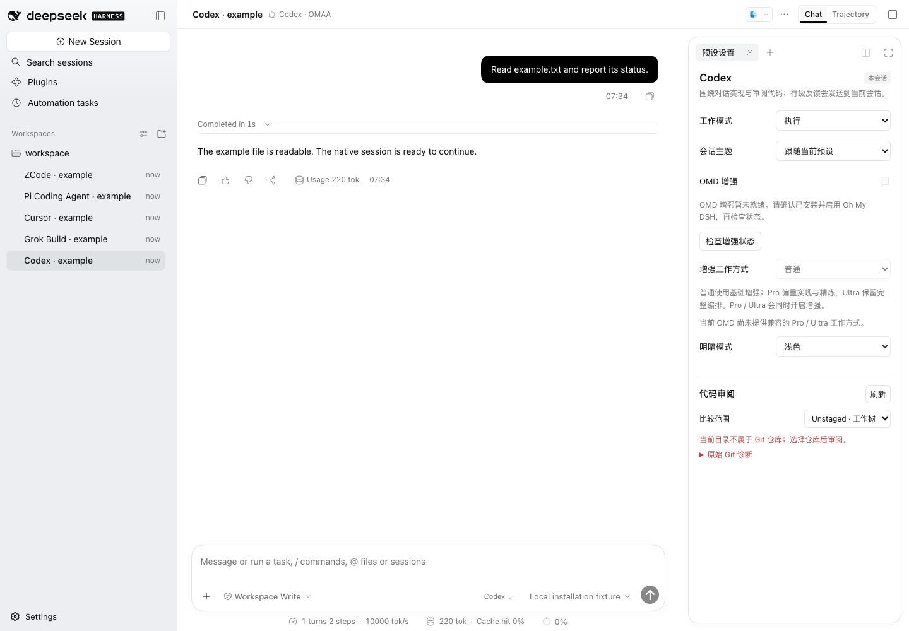
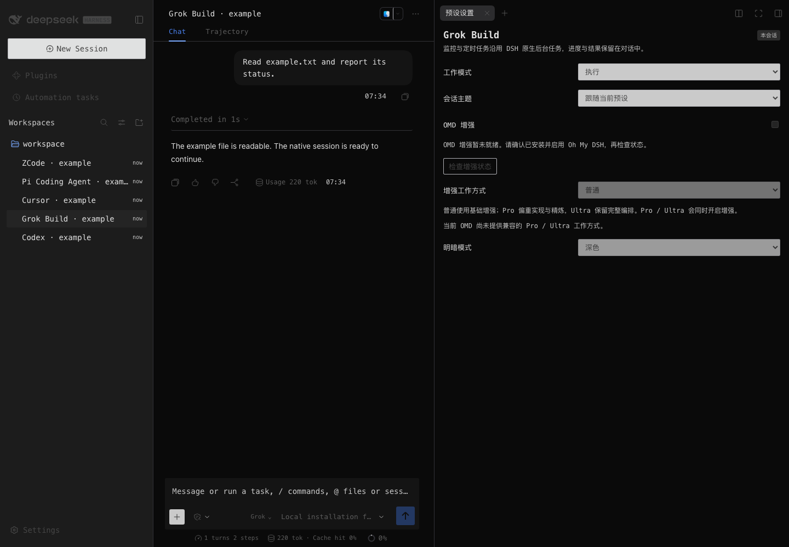
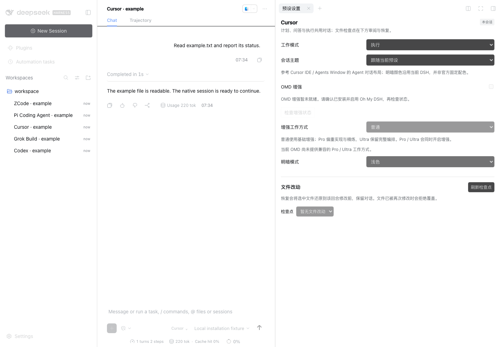
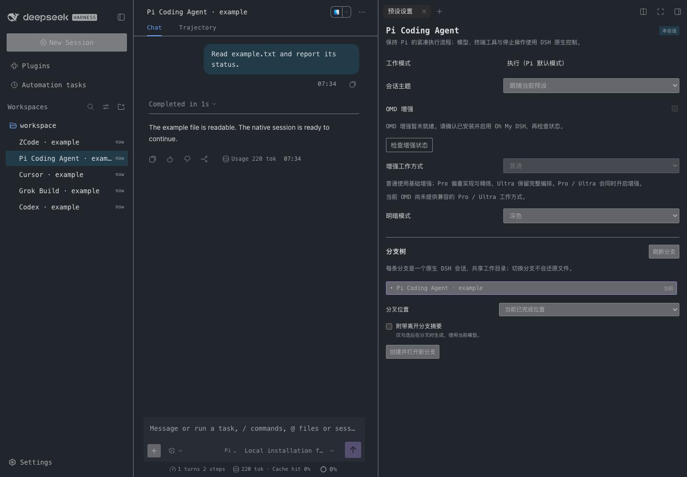
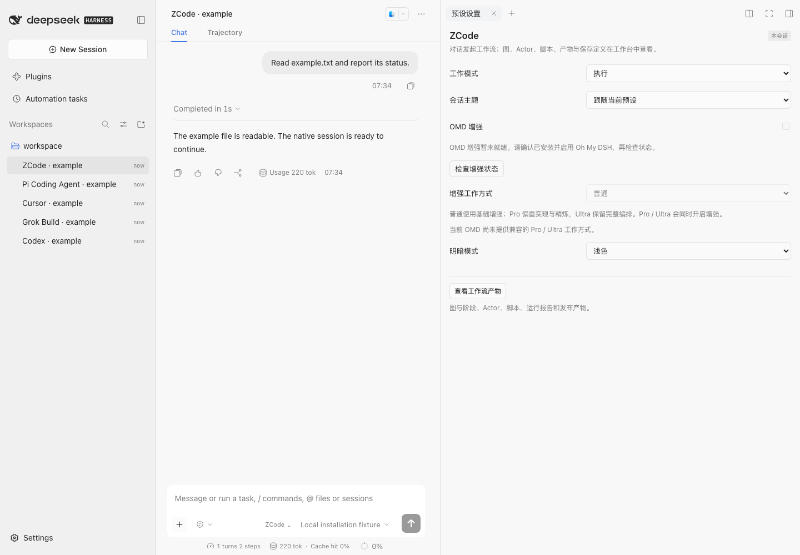

# 五产品真实界面

以下是 **OMAA 0.2.1-alpha.2.omaa.0.15.0 候选**在官方 **DSH 0.2.1-alpha.2 Web** 中的实际全宽截图，采集于 2026-10-10。每个会话使用隔离 HOME、合成工作区、本地模拟模型和 Chrome for Testing，执行了原生 read 工具回合；没有真实账号、个人材料或硬件动作。截图不是官方五产品客户端，也不是组件 mockup。

此组展示独立 OMAA：未安装 OMD，增强开关如实显示未就绪；完整配对与增强验收另见[会话工作台](frontend-workbench.md)。保存明暗设置完成后才截图，没有用禁用增强代替组合验收。图片逐字复制自 Native 页面，未拼接或重绘。[版本与逐图 SHA-256](images/frontend-015/source.json)绑定采集时的冻结包及客户端文件；后续文档加入截图不改变这些运行文件。

## Codex

代码审阅保留真实非 Git 错误状态，并可展开原始诊断。

[浅色全宽](images/frontend-015/codex-light.png) · [深色全宽](images/frontend-015/codex-dark.png)

## Grok Build

独立的紧凑字形与暗色外观，监控和定时任务继续使用原生流程。

[浅色全宽](images/frontend-015/grok-light.png) · [深色全宽](images/frontend-015/grok-dark.png)

## Cursor

继承 DSH 配色；计划、问答、执行与文件检查点位于同一右栏。

[浅色全宽](images/frontend-015/cursor-light.png) · [深色全宽](images/frontend-015/cursor-dark.png)

## Pi Coding Agent

默认执行模式、精简设置和原生分支导航。

[浅色全宽](images/frontend-015/pi-light.png) · [深色全宽](images/frontend-015/pi-dark.png)

## ZCode

以对话发起工作流，通过工作台入口查看图、Actor 与产物。

[浅色全宽](images/frontend-015/zcode-light.png) · [深色全宽](images/frontend-015/zcode-dark.png)

README 的品牌封面是独立的生成插画，来源记录为仓库 `assets/marketing/omaa-workspace-2026-10-10.source.json`；它不属于上述 Native 界面证据。历史封面保留原文件。
